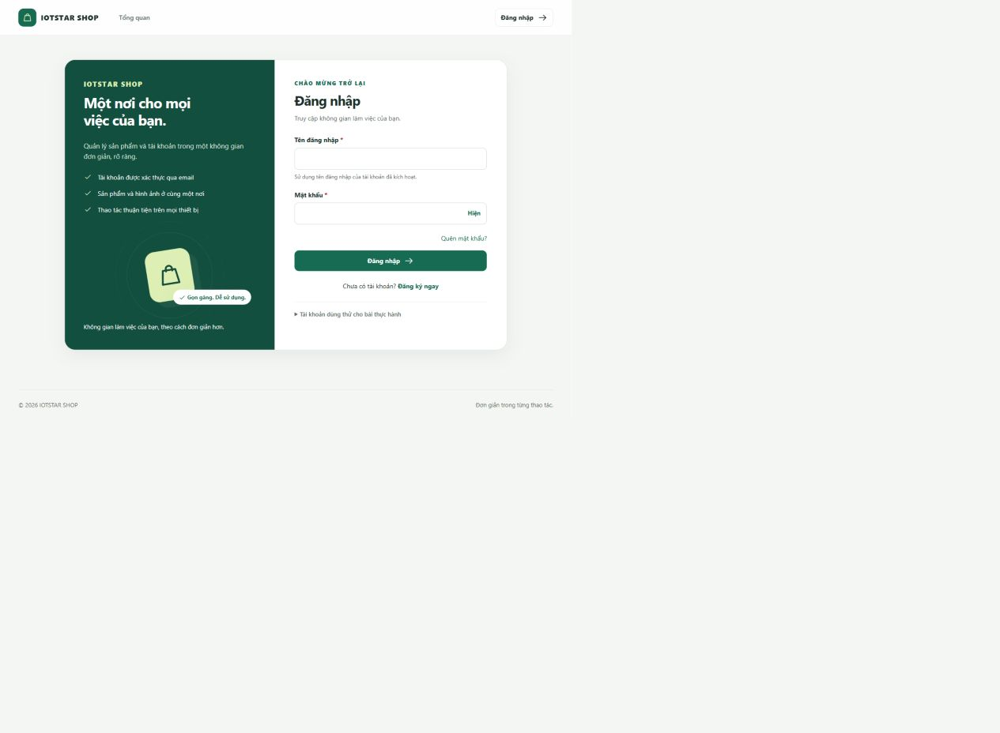
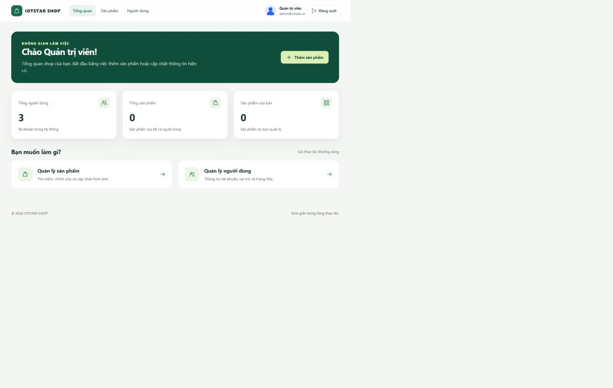
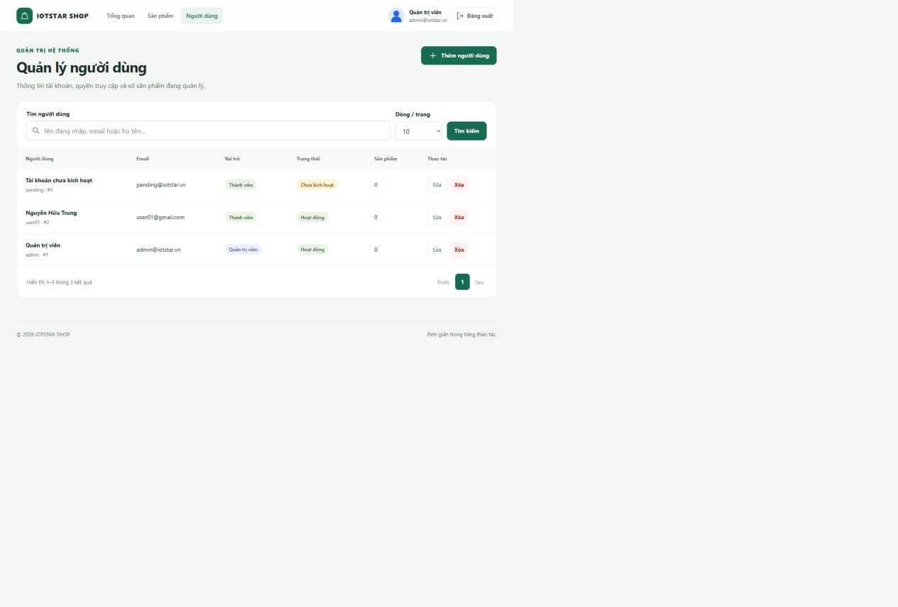
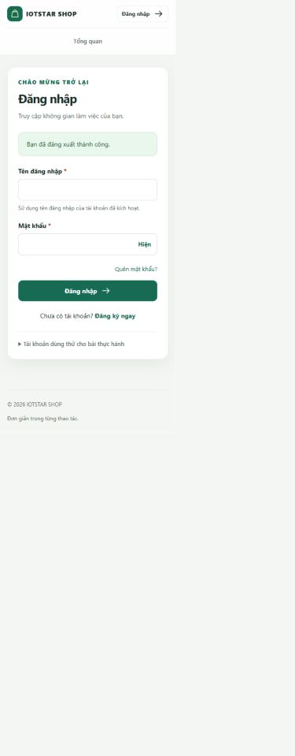
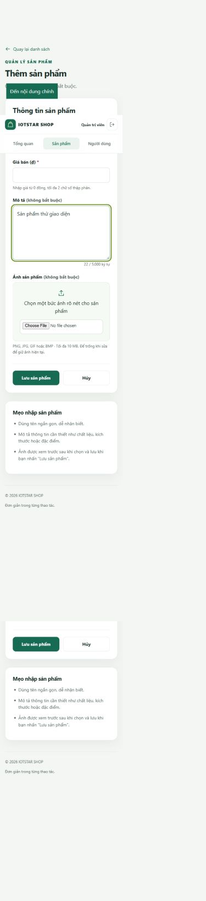

# Giao diện và trải nghiệm sử dụng

Giao diện được nâng cấp đồng bộ cho ba ví dụ ngày 28/09/2026. Tông xanh lục, nền sáng và các vùng nội dung rõ ràng giúp người dùng nhận biết thao tác chính. Font hệ thống, CSS, JavaScript và icon SVG đều nằm trong project, không cần CDN.

## Nguồn tham khảo và cách áp dụng

| Nguồn | Áp dụng trong bài |
|---|---|
| [GOV.UK: Password input](https://design-system.service.gov.uk/components/password-input/) | Nút hiện/ẩn mật khẩu có nhãn truy cập, không chặn dán, hỗ trợ trình quản lý mật khẩu; chỉ hiện nút khi JavaScript hoạt động. |
| [GOV.UK: Pagination](https://design-system.service.gov.uk/components/pagination/) | Trang hiện tại có `aria-current`, nút trước/sau, cửa sổ số trang và dấu ba chấm; giữ từ khóa và số dòng khi chuyển trang. |
| [W3C WAI: Labeling controls](https://www.w3.org/WAI/tutorials/forms/labels/) | Nhãn luôn hiển thị và liên kết với trường nhập; gợi ý và lỗi liên kết qua `aria-describedby`. |
| [W3C WAI: User notifications](https://www.w3.org/WAI/tutorials/forms/notifications/) | Lỗi tổng hợp nhận focus sau khi gửi form; lỗi từng trường bằng tiếng Việt, `aria-invalid`; thông báo thành công có `role="status"`. |

Các nguồn được dùng để tham khảo hành vi và khả năng truy cập. Bố cục, màu sắc và đồ họa của giao diện được thiết kế riêng cho bài.

## Những thay đổi chính

- Điều hướng rõ ràng theo quyền truy cập; mục hiện tại được đánh dấu. Header hiển thị thông tin principal và nút đăng xuất.
- Đăng nhập có hiện/ẩn mật khẩu, autocomplete và thông báo trạng thái. Tài khoản mẫu nằm trong phần có thể mở rộng.
- Đăng ký có tiến trình ba bước. OTP dùng một ô 6 chữ số, bàn phím số, autocomplete, hướng dẫn hạn dùng và gửi lại.
- Dashboard có số liệu thực tế, nút thêm sản phẩm và lối tắt quản lý. Tài khoản thành viên thấy sản phẩm của mình; quản trị viên thấy số liệu toàn hệ thống.
- Bảng có nhãn tìm kiếm, chọn số dòng, trạng thái tài khoản dễ đọc, tổng kết kết quả và phân trang gọn. Không có dữ liệu và không tìm thấy kết quả có hướng dẫn tiếp theo.
- Form sản phẩm có đếm ký tự mô tả, xem trước ảnh, bỏ ảnh vừa chọn và kiểm tra định dạng/dung lượng ở trình duyệt. Server tiếp tục kiểm tra nội dung ảnh và giới hạn 10 MB.
- Khi gửi form POST hợp lệ, nút hiện trạng thái đang xử lý và chặn gửi lặp. Khôi phục nút khi quay lại bằng lịch sử trình duyệt.
- Xóa cần xác nhận có tên bản ghi và hậu quả; hộp thoại nhận focus ở nút “Giữ lại”, có thể đóng bằng Escape và trả focus về nút ban đầu.
- Có liên kết bỏ qua điều hướng, focus dễ thấy và hỗ trợ giảm chuyển động. Trên điện thoại, form dùng một cột; bảng cuộn ngang trong vùng riêng.

Ví dụ 1 và 3 tiếp tục ghép layout bằng Thymeleaf fragments. Ví dụ 2 tiếp tục dùng Thymeleaf Layout Dialect. Các đường dẫn, tên trường login, CSRF, session, quyền sở hữu sản phẩm, SQL Server, SMTP và Cloudinary giữ nguyên hợp đồng chức năng.

## Xác minh

- `mvn clean verify`: 45 test đạt; gồm ba test mới bảo đảm `/js/app.js` được tải khi chưa đăng nhập.
- Trình duyệt với các ứng dụng dùng SQL Server: login email ở ví dụ 1, login email ở ví dụ 2, login username/admin ở ví dụ 3; kiểm tra header và logout.
- Kiểm tra hiện/ẩn mật khẩu, tìm kiếm không có kết quả, phân trang với `size=1`, mở/hủy xác nhận xóa và focus mặc định.
- Kiểm tra chọn/bỏ ảnh xem trước, đếm ký tự và phản hồi validation khi giá vượt giới hạn; bản ghi không được tạo từ dữ liệu không hợp lệ.
- Kiểm tra form trên viewport 320, 390 và 768 px; các màn hình đã kiểm tra không tràn ngang trang. Bảng giữ vùng cuộn ngang riêng.
- Lần kiểm tra giao diện không gửi thêm email OTP hoặc thay đổi mật khẩu/tài khoản mẫu.

Đây là kiểm tra chức năng và bố cục trên trình duyệt của máy hiện tại, chưa phải chứng nhận đầy đủ WCAG hoặc kiểm thử trên mọi thiết bị.

## Ảnh minh chứng

| Đăng nhập trên điện thoại | Form sản phẩm trên điện thoại |
|---|---|
|  |  |

Hai ví dụ đăng nhập: [Ví dụ 1](screenshots/ui-vd1-account.png), [Ví dụ 2](screenshots/ui-vd2-account.png).
